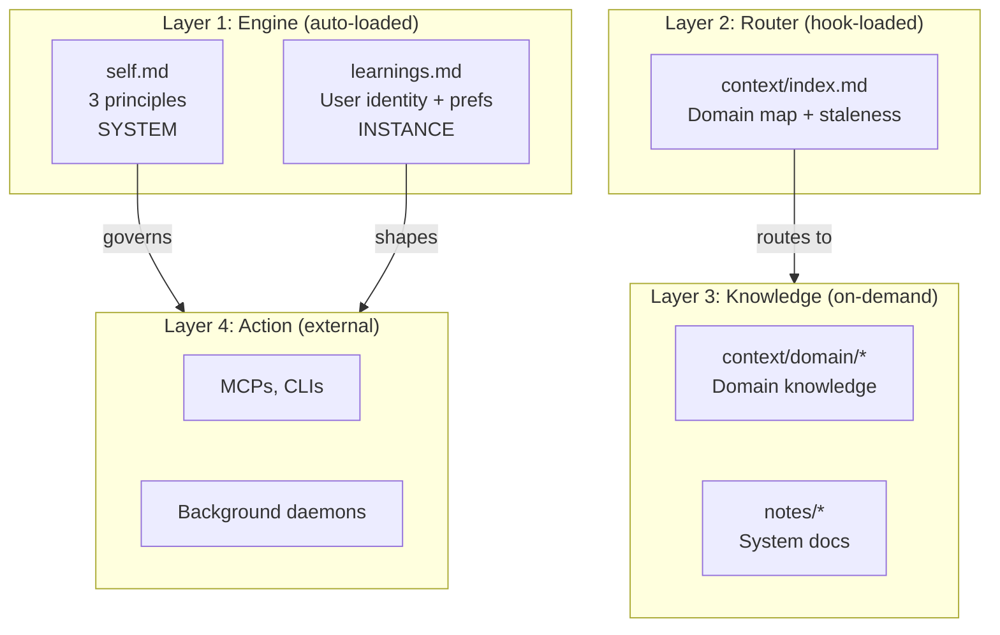
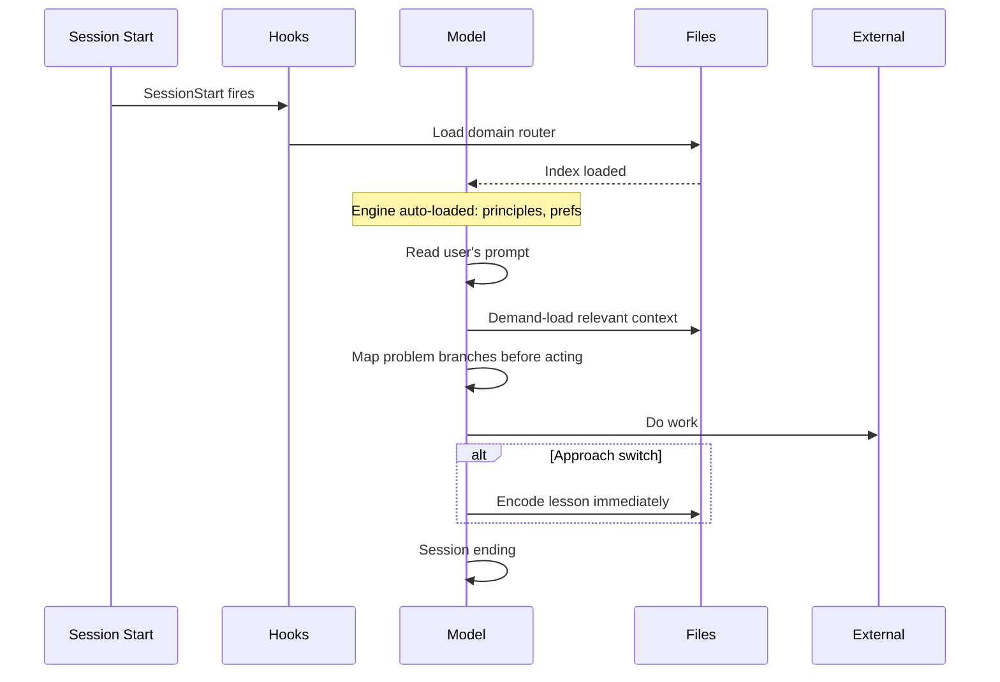
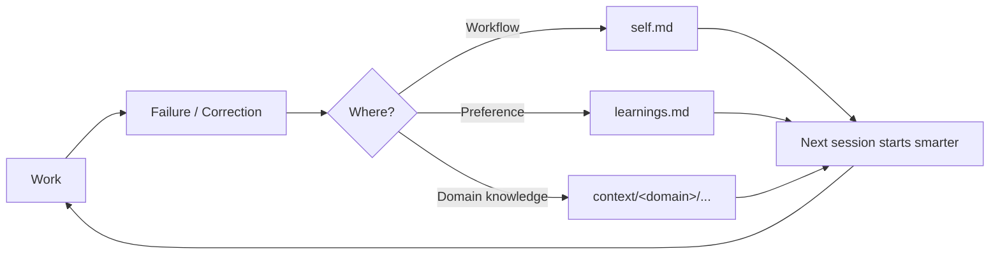

# Architecture

A self-weaving context system. Domain-agnostic - works for any user, any project, any model wrapper.

---

## Core Architecture

4 layers. Each can modify itself and layers below it.

## Execution Flow

## The Feedback Loop

## Design Principles

1. **Orientation over information** - auto-loaded files provide compass, not map. Demand-load the territory.
2. **Earn your tokens** - anything auto-loaded must justify its cost every session.
3. **The model is the system** - the runtime is a ceiling, not a floor. Thinnest possible infrastructure, maximum model. Don't build frameworks - build plumbing.
4. **System and instance never mix** - replace the user and their projects: system files still work, instance files don't.

The 3 operating principles in `self.md`:
1. **Depth over speed** - map before moving, demand-load, converge
2. **Every observation becomes an action** - encode immediately, logs are queues
3. **Seek what you're not seeing** - external perspective, patterns as signals

## The Tree Primitive

The storage model. All persistent knowledge is a tree: an index that orients, pointing to leaves that hold depth. Every structure below - layers, session state - is an instance of this pattern.

**Properties:**
- **Index + leaves.** Index says what exists and when to load it. Leaves hold content. Model reads the index, demand-loads leaves.
- **Bounded nodes.** No node exceeds its context budget. Oversized nodes split: file becomes directory with `index.md` + leaves.
- **Recursive.** A leaf can become a subtree. Depth unbounded; width bounded by what fits in one index.
- **Self-maintaining.** `/maintain` detects oversized nodes and decomposes them. Growth is organic; the tree rebalances through use.
- **Structure-agnostic.** The primitive defines shape, not policy. Loading rules, naming conventions, and depth constraints are instance-specific. Agents build trees freely; instances add their own conventions.

| Instance | Index | Leaves | Split trigger |
|----------|-------|--------|---------------|
| Domain routing | `context/index.md` -> `context/<domain>/index.md` | Domain context files | New domain |
| Knowledge files | `<topic>/index.md` | `<topic>/<subtopic>.md` | Node exceeds ~10KB |

Path conventions and loading policies are instance-specific. The tree structure is universal.

**Cross-References (BETA):** Lateral links via `<!-- related: path1, path2 -->` HTML comments. Bidirectional by convention; `tree-check.sh` surfaces them on Read, validates on Write. `/maintain` audits for dead links and missing backlinks. See `notes/tree-primitive.md`.

### Relationship to RAG

The tree primitive is a form of **agentic RAG** - specifically, model-curated hierarchical retrieval where the LLM is simultaneously indexer, retriever, query engine, and graph maintainer.

**RAG taxonomy mapping:**

| RAG concept | Tree primitive equivalent |
|---|---|
| Chunking | Manual/agent-curated logical splits into leaf files |
| Index structure | Hand-built tree (index.md + leaves) vs flat vector store or auto-generated graph |
| Hierarchy | Explicitly designed (recursive subtrees) vs auto-discovered (Leiden communities, RAPTOR clustering) |
| Summaries | Hand-written index files vs LLM-generated community reports |
| Retrieval | Semantic navigation (model reads index, decides) vs algorithmic (similarity, PageRank, BFS) |
| Re-indexing | `/maintain` (compress, deduplicate, split) vs batch graph re-extraction |

Closest published analog: **RAPTOR** (tree of hierarchical summaries). Key difference: RAPTOR auto-generates its tree (embed, cluster, summarize, repeat). only-agent trees are built by the agent during use - write-ahead (built during knowledge creation) rather than write-behind (extracted from existing documents).

**What scales:**
- Hierarchical navigation - tree depth grows logarithmically with corpus size
- Incremental updates - adding knowledge is O(depth), never reindex everything
- Subtree maintenance - `/maintain` on a single subtree works regardless of total tree size

**Scaling limits:**
- **Cross-cutting queries** - "find everything about X across all subtrees" requires reading every index. Trees are great for drill-down, poor for lateral search. At scale, augment with semantic search (grep/vector similarity) as a fallback.
- **Curation bottleneck** - one agent can maintain structure while it fits in context. Beyond that, needs subtree ownership (agents that maintain branches independently).
- **Staleness compounds** - stale indexes in one subtree silently hide content. Larger trees need more aggressive staleness detection.

The ceiling is roughly when the root index chain (all indexes from root to deepest leaf) exceeds context, or when maintenance of the full tree exceeds one session.

## Layers

Built on the tree primitive. Each layer is a node (or subtree) at a different loading priority.

| Layer | Loaded | Writing policy |
|-------|--------|----------------|
| **1: Engine** | Every session, permanent token tax | Terse. Every line must change behavior. |
| **2: Router** | Every session / on domain activate | Orientation only. Pointers, not content. |
| **3: Knowledge** | On demand, when topic comes up | Depth is the point. Compress for clarity, not brevity. |
| **4: Action** | Never in model context (executed) | Optimize for correctness, not size. |

### Layer 1: Engine (auto-loaded)

| File | Scope | Contains |
|------|-------|----------|
| `self.md` | System | 3 principles, persistence table, structural notes |
| `learnings.md` | Instance | Identity, preferences, style, context system pointer |

### Layer 2: Router (hook-loaded)

Domain routing is a tree primitive instance with a specific loading policy:
- **Root** (`context/index.md`): Domain map. Auto-loaded every session by hook.
- **Domain indexes** (`context/<domain>/index.md` + `learnings.md`): Subtree roots. Loaded on domain activate.
- **Domain leaves** (domain files): On demand, per domain index.
- **Shared** (`context/shared/`): Cross-domain resources, reachable from any domain.

### Layer 3: Knowledge (on-demand)
Domain leaf files + system notes (`notes/`). Staleness tracked in domain indexes. Oversized nodes become subtrees per the tree primitive. Analysis, design rationale, and reference depth belong here - this is where the system's understanding lives.

### Layer 4: Action (external)
MCPs, CLIs, background daemons, built tools. Settings, scripts, skills. Governed by principles and preferences. External actions draft-first.

Decision guide for new integrations: `notes/service-integration.md`

### Meta: Cross-cutting
- **Hooks**: Safety gates + session lifecycle (see `.claude/settings.json`)
- **Skills**: `/onboard` (build initial work tree), `/maintain` (system-level cleanup), `/goal-loop` (force iteration until verification passes - see `goal-loop-primitive.md`)

---

## Directory Contract

| Directory | Scope |
|-----------|-------|
| `notes/` | **System** - design and reference docs |
| `.claude/rules/self.md` | **System** - operating principles |
| `.claude/rules/learnings.md` | **Instance** - universal user prefs |
| `context/index.md` | **Router** - domain map (root of routing tree) |
| `context/shared/` | **Instance** - cross-domain identity |
| `context/<domain>/` | **Instance** - domain knowledge |

### System files (`notes/`)
- `architecture.md` - this file
- `connections.md` - service integration recipes
- `service-integration.md` - decision tree for new integrations
- `tree-primitive.md` - tree node convention, design rationale
- `goal-loop-primitive.md` - gated output loops spec
